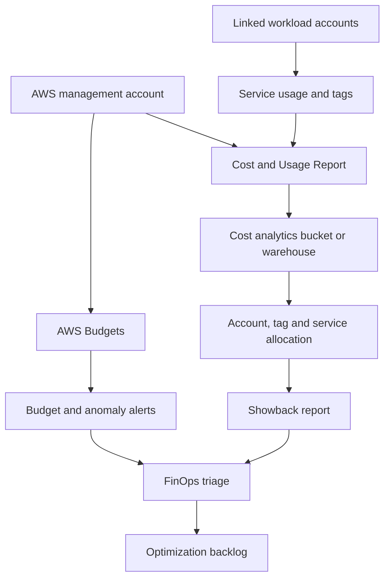
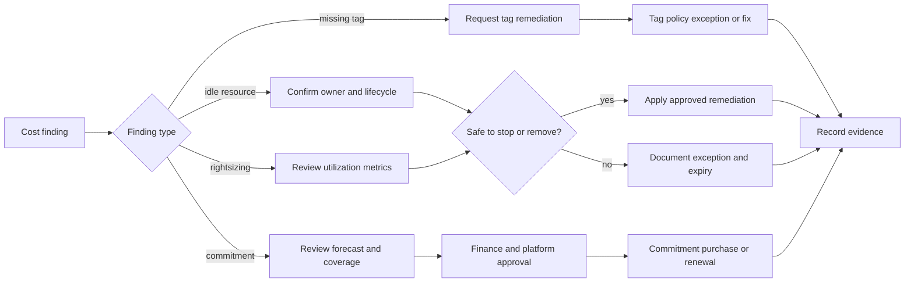
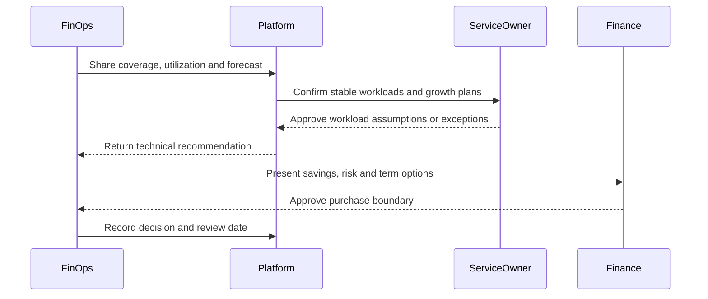
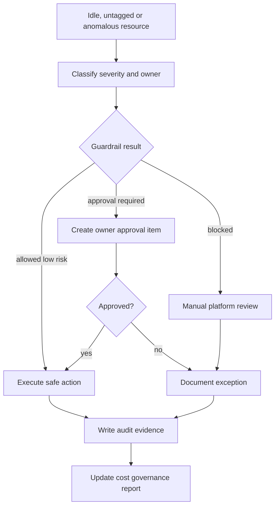

# AWS FinOps Visual Diagrams

These diagrams describe the review flow for AWS cost allocation, optimization, commitments and automated remediation. They are designed for GitHub rendering with Mermaid.

## Multi-Account Cost Flow

## Optimization Decision Tree

## Commitment Review Cadence

## Automated Remediation Guardrails

## How to Use These Diagrams

Use the diagrams to review whether automation has clear inputs, owners, approval paths and evidence. Any action that can affect availability, security posture or customer-facing workloads should require explicit owner approval.
